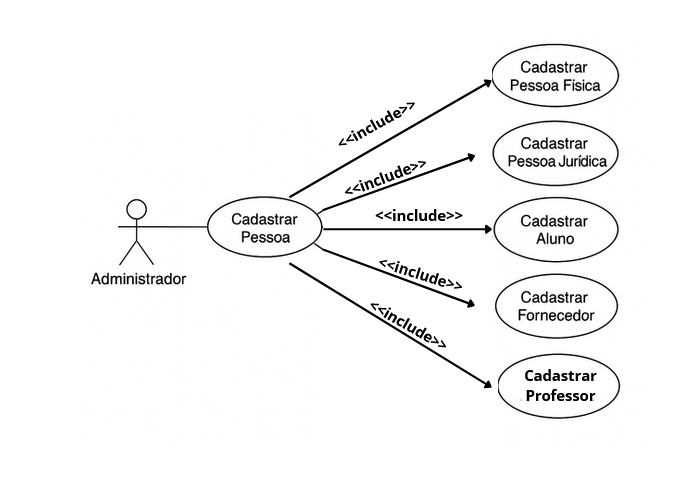

# Sistema de Gestão de Cadastros

Projeto desenvolvido como parte do **Projeto Integrador - 3° semestre de ADS (Senac, 2025)**.  
O sistema tem como objetivo facilitar o gerenciamento de cadastros de pessoas físicas, jurídicas, alunos, professores e fornecedores.

---

## 👥 Integrantes do Grupo
- Gabriel Estalise    
- [adicione os demais nomes aqui]

---

## 🎯 Objetivo do Sistema
Permitir o cadastro, edição, exclusão e listagem de pessoas físicas, jurídicas, alunos, professores e fornecedores, de forma simples e centralizada.

---

## 🧩 Diagrama de Casos de Uso

**Descrição:** O diagrama abaixo representa o relacionamento entre o ator *Administrador* e os casos de uso principais do sistema.

---

## 🏗️ Diagrama de Classes

O diagrama de classes representa a estrutura lógica do sistema, suas entidades e heranças entre as classes.

---

## 🖥️ Protótipos das Telas

**Tela Inicial**

**Tela de Cadastro de Pessoa Física**

**Tela de Cadastro de Pessoa Jurídica**

---

## ⚙️ Tecnologias Utilizadas
- Linguagem: Java / HTML / CSS (ajuste conforme o projeto real)
- Banco de Dados: MySQL
- Ferramenta de Versionamento: Git e GitHub
- Modelagem: UML (Draw.io / Lucidchart)

---

## 🧾 Casos de Uso Documentados
**Caso de Uso Principal: Cadastrar Pessoa**

- **Pré-condição:** Administrador autenticado  
- **Pós-condição:** Cadastro registrado no sistema  

**Cenário Principal:**  
O administrador acessa o sistema, preenche os dados da pessoa e confirma o cadastro.  
O sistema valida, salva e exibe mensagem de sucesso.

**Cenários Alternativos:**
1. Dados inválidos (CPF/CNPJ incorreto) → Sistema exibe mensagem de erro.  
2. CPF/CNPJ duplicado → Sistema alerta sobre duplicidade e solicita ação.  

---

## 🧠 Observações
Este projeto foi desenvolvido com fins acadêmicos e reflete o aprendizado das disciplinas de:
- Programação Orientada a Objetos  
- Banco de Dados  
- Engenharia de Software  
- Interface e Usabilidade

---

© 2025 — Projeto Integrador | Curso de Análise e Desenvolvimento de Sistemas — **Senac**
